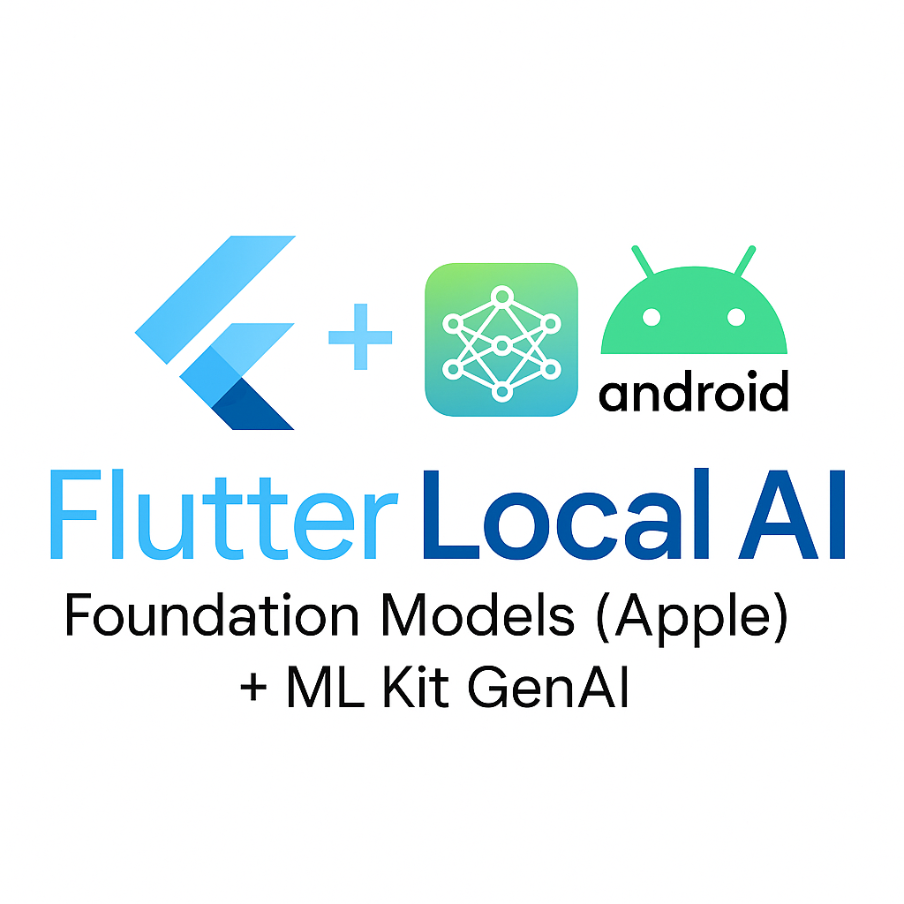
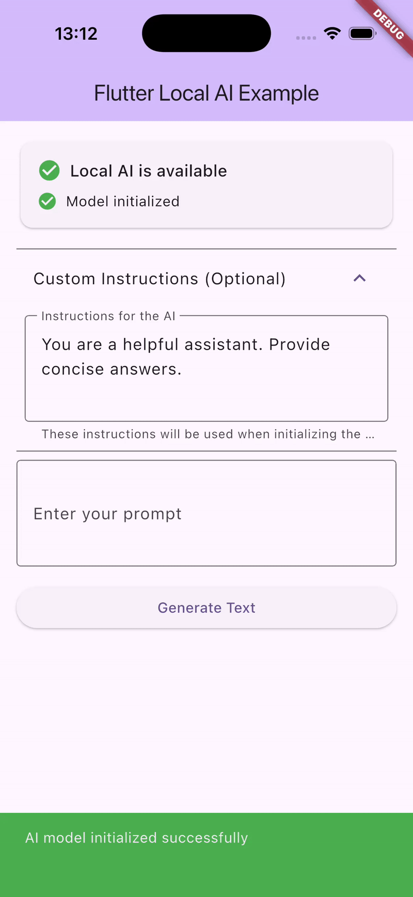

<div align="center">
  
</div>

<div align="center">

# Flutter Local AI

A Flutter package that provides a unified API for local AI inference on Android with [*ML Kit GenAI*](https://developer.android.com/ai/gemini-nano/ml-kit-genai) and on Apple Platforms using [*Foundation Models*](https://developer.apple.com/documentation/FoundationModels) .

</div>

<div align="center">
  
</div>


## ✨ Unique Advantage

**This package has the unique advantage of using native OS APIs without downloading or adding any additional layer to the application.**

- **iOS**: Uses Apple's built-in FoundationModels framework (iOS 26.0+) - no model downloads required
- **Android**: Uses Google's ML Kit GenAI (Gemini Nano) - leverages the native on-device model
- **Zero Model Downloads**: No need to bundle large model files with your app
- **Native Performance**: Direct access to OS-optimized AI capabilities
- **Smaller App Size**: Models are part of the operating system, not your app bundle

## Platform Support

| Feature            | iOS (26+) | macOS (26+) | Android (API 26+) |
|--------------------|-----------|-------------|-------------------|
| Text generation    | ✅        |  ✅          |👨‍💻 Work in progress |
| Summarization*     | 🚧 Planned| 🚧 Planned   | 🚧 Planned        |
| Image generation   | 🚧 Planned| 🚧 Planned   | ❌                |
| Tool call          | ❌        | ❌           | ❌                |

*Summarization is achieved through text-generation prompts and shares the same API surface.

## Installation

Add this to your package's `pubspec.yaml` file:

```yaml
dependencies:
  flutter_local_ai:
    git:
      url: https://github.com/kekko7072/flutter_local_ai.git
```

Or if published to pub.dev:

```yaml
dependencies:
  flutter_local_ai: 0.0.1-dev.8
```

### Android Setup

Requires Android API level 26 (Android 8.0 Oreo) or higher.

1. Set the minimum SDK version in your `android/app/build.gradle` or `android/app/build.gradle.kts`:

For `build.gradle.kts` (Kotlin DSL):
```kotlin
android {
    defaultConfig {
        minSdk = 26
    }
}

dependencies {
    implementation("com.google.mlkit:genai-prompt:1.0.0-alpha1")
}
```

For `build.gradle` (Groovy DSL):
```groovy
android {
    defaultConfig {
        minSdkVersion 26
    }
}

dependencies {
    implementation 'com.google.mlkit:genai-prompt:1.0.0-alpha1'
}
```

2. Sync your project with Gradle files.

#### Important: Google AICore Requirement

Android's ML Kit GenAI requires **Google AICore** to be installed on the device. AICore is a separate system-level app that provides on-device AI capabilities (similar to Google Play Services).

**Error Code -101**: If you encounter error code -101, it means:
- AICore is not installed on the device, OR
- The installed AICore version is too low

**How to Handle AICore Not Installed:**

```dart
final aiEngine = FlutterLocalAi();

try {
  final isAvailable = await aiEngine.isAvailable();
  if (!isAvailable) {
    print('Local AI is not available on this device');
    return;
  }
} catch (e) {
  // Check if it's an AICore error (error code -101)
  if (e.toString().contains('-101') || e.toString().contains('AICore')) {
    // Show a dialog to the user explaining they need to install AICore
    // Then open the Play Store for them to install it
    await aiEngine.openAICorePlayStore();
  } else {
    print('Error: $e');
  }
}
```

**Manual Installation Link:**
Users can manually install AICore from:
https://play.google.com/store/apps/details?id=com.google.android.aicore

**Note:** AICore is currently in limited availability and may not be available on all devices or in all regions. It's recommended to check device compatibility and provide fallback options in your app.

#### Debugging AICore Issues

If you're getting an AICore error on a device where AICore **IS** installed, the actual problem may be different (model not downloaded, permissions, etc.). The plugin now provides detailed error logging:

**View error details in Android Logcat:**
```bash
adb logcat -s FlutterLocalAi:E
```

The logs will show the actual exception type and error message, helping you identify the real issue. See `DEBUGGING_AICORE.md` for a complete debugging guide.

### iOS Setup

Requires iOS 26.0 or higher.

This plugin uses Swift Package Manager (SPM) for dependency management on iOS. The FoundationModels framework is automatically integrated by Flutter when you build your project.

#### Configuration Steps:

1. Open your iOS project in Xcode:
   - Open `ios/Runner.xcodeproj` in Xcode
   - Select the "Runner" project in the navigator
   - Under "Targets" → "Runner" → "General"
   - Set **Minimum Deployments** → **iOS** to **26.0**

2. In your `ios/Runner.xcodeproj/project.pbxproj`, verify that `IPHONEOS_DEPLOYMENT_TARGET` is set to `26.0`:

```
IPHONEOS_DEPLOYMENT_TARGET = 26.0;
```

3. If you encounter issues with SPM integration:

```bash
cd ios
flutter pub get
flutter clean
flutter build ios
```

### macOS Setup

Requires macOS 26.0 or higher.

The plugin uses Swift Package Manager (SPM) for dependency management on macOS. The FoundationModels framework is automatically integrated by Flutter when you build your project.

#### Configuration Steps:

1. Open your macOS project in Xcode:
   - Open `macos/Runner.xcodeproj` in Xcode
   - Select the "Runner" project in the navigator
   - Under "Targets" → "Runner" → "General"
   - Set **Minimum Deployments** → **macOS** to **26.0**

2. In your `macos/Runner.xcodeproj/project.pbxproj`, verify that `MACOSX_DEPLOYMENT_TARGET` is set to `26.0`:

```
MACOSX_DEPLOYMENT_TARGET = 26.0;
```

3. If you encounter issues with SPM integration:

```bash
cd macos
flutter pub get
flutter clean
flutter build macos
```

## Usage

> **Note:** Currently, text generation is only available on iOS 26.0+ and macOS 26.0+. Android support is planned for a future release.

### Basic Usage

```dart
import 'package:flutter_local_ai/flutter_local_ai.dart';

// Initialize the AI engine
final aiEngine = FlutterLocalAi();

// Check if Local AI is available on this device
final isAvailable = await aiEngine.isAvailable();
if (!isAvailable) {
  print('Local AI is not available on this device');
  print('Requires iOS 26.0+ or macOS 26.0+');
  return;
}

// Initialize the model with custom instructions
// This is required and creates a LanguageModelSession
await aiEngine.initialize(
  instructions: 'You are a helpful assistant. Provide concise answers.',
);

// Generate text with the simple method (returns just the text string)
final text = await aiEngine.generateTextSimple(
  prompt: 'Write a short story about a robot',
  maxTokens: 200,
);
print(text);
```

### Advanced Usage with Configuration

```dart
import 'package:flutter_local_ai/flutter_local_ai.dart';

final aiEngine = FlutterLocalAi();

// Check availability
if (!await aiEngine.isAvailable()) {
  print('Local AI is not available on this device');
  return;
}

// Initialize with custom instructions
await aiEngine.initialize(
  instructions: 'You are an expert in science and technology. Provide detailed, accurate explanations.',
);

// Generate text with detailed configuration
final response = await aiEngine.generateText(
  prompt: 'Explain quantum computing in simple terms',
  config: const GenerationConfig(
    maxTokens: 300,
    temperature: 0.7,  // Controls randomness (0.0 = deterministic, 1.0 = very random)
    topP: 0.9,         // Nucleus sampling parameter
    topK: 40,          // Top-K sampling parameter
  ),
);

// Access detailed response information
print('Generated text: ${response.text}');
print('Token count: ${response.tokenCount}');
print('Generation time: ${response.generationTimeMs}ms');
```

### Streaming Text Generation (Coming Soon)

Streaming support for real-time text generation is planned for a future release.

### Complete Example

Here's a complete example showing error handling and best practices:

```dart
import 'package:flutter/material.dart';
import 'package:flutter_local_ai/flutter_local_ai.dart';

class LocalAiExample extends StatefulWidget {
  @override
  _LocalAiExampleState createState() => _LocalAiExampleState();
}

class _LocalAiExampleState extends State<LocalAiExample> {
  final aiEngine = FlutterLocalAi();
  bool isInitialized = false;
  String? result;
  bool isLoading = false;

  @override
  void initState() {
    super.initState();
    _initializeAi();
  }

  Future<void> _initializeAi() async {
    try {
      final isAvailable = await aiEngine.isAvailable();
      if (!isAvailable) {
        setState(() {
          result = 'Local AI is not available on this device. Requires iOS 26.0+ or macOS 26.0+';
        });
        return;
      }

      await aiEngine.initialize(
        instructions: 'You are a helpful assistant. Provide concise and accurate answers.',
      );

      setState(() {
        isInitialized = true;
        result = 'AI initialized successfully!';
      });
    } catch (e) {
      setState(() {
        result = 'Error initializing AI: $e';
      });
    }
  }

  Future<void> _generateText(String prompt) async {
    if (!isInitialized) {
      setState(() {
        result = 'AI is not initialized yet';
      });
      return;
    }

    setState(() {
      isLoading = true;
    });

    try {
      final response = await aiEngine.generateText(
        prompt: prompt,
        config: const GenerationConfig(
          maxTokens: 200,
          temperature: 0.7,
        ),
      );

      setState(() {
        result = response.text;
        isLoading = false;
      });
    } catch (e) {
      setState(() {
        result = 'Error generating text: $e';
        isLoading = false;
      });
    }
  }

  @override
  Widget build(BuildContext context) {
    return Scaffold(
      appBar: AppBar(title: const Text('Flutter Local AI')),
      body: Padding(
        padding: const EdgeInsets.all(16.0),
        child: Column(
          children: [
            ElevatedButton(
              onPressed: isLoading ? null : () => _generateText('Tell me a joke'),
              child: const Text('Generate Joke'),
            ),
            const SizedBox(height: 20),
            if (isLoading)
              const CircularProgressIndicator()
            else if (result != null)
              Text(result!),
          ],
        ),
      ),
    );
  }
}
```

### Platform-Specific Notes

#### iOS & macOS

- **Initialization is required**: You must call `initialize()` before generating text. This creates a `LanguageModelSession` with your custom instructions.
- **Session reuse**: The session is cached and reused for subsequent generation calls until you call `initialize()` again with new instructions.
- **Automatic fallback**: If you don't call `initialize()` explicitly, it will be called automatically with default instructions when you first generate text. However, it's recommended to call it explicitly to set your custom instructions.
- **Model availability**: The FoundationModels framework is automatically available on devices running iOS 26.0+ or macOS 26.0+.

#### Android

Android support using ML Kit GenAI (Gemini Nano) is currently in development and will be available in a future release.

## API Reference

### `FlutterLocalAi`

Main class for interacting with local AI.

#### Methods

- `Future<bool> isAvailable()` - Check if local AI is available on the device
- `Future<bool> initialize({String? instructions})` - Initialize the model and create a session with instruction text (required for iOS, optional for Android)
- `Future<AiResponse> generateText({required String prompt, GenerationConfig? config})` - Generate text from a prompt with optional configuration
- `Future<String> generateTextSimple({required String prompt, int maxTokens = 100})` - Convenience method to generate text and return just the string

### `GenerationConfig`

Configuration for text generation.

- `maxTokens` (int, default: 100) - Maximum number of tokens to generate
- `temperature` (double?, optional) - Temperature for generation (0.0 to 1.0)
- `topP` (double?, optional) - Top-p sampling parameter
- `topK` (int?, optional) - Top-k sampling parameter

### `AiResponse`

Response from AI generation.

- `text` (String) - The generated text
- `tokenCount` (int?) - Token count used
- `generationTimeMs` (int?) - Generation time in milliseconds

## Implementation Notes

### Android
The Android implementation uses ML Kit GenAI (Gemini Nano). The API structure may need to be verified against the latest ML Kit GenAI documentation as the API might evolve.

### iOS
The iOS implementation uses Apple's FoundationModels framework (iOS 26.0+). The implementation:

- Uses `SystemLanguageModel.default` for model access
- Creates a `LanguageModelSession` with custom instructions
- Handles model availability checking
- Provides on-device text generation with configurable parameters

**Key iOS Requirements:**
- iOS 26.0 or later
- Xcode 16.0 or later
- FoundationModels framework (automatically available on supported devices)

**iOS Initialization:**
On iOS, you must call `initialize()` before generating text. This creates a `LanguageModelSession` with your custom instructions. The session is cached and reused for subsequent generation calls.

```dart
// Required on iOS
await aiEngine.initialize(
  instructions: 'Your custom instructions here',
);
```

## Contributing

Contributions are welcome! Please feel free to submit a Pull Request.
