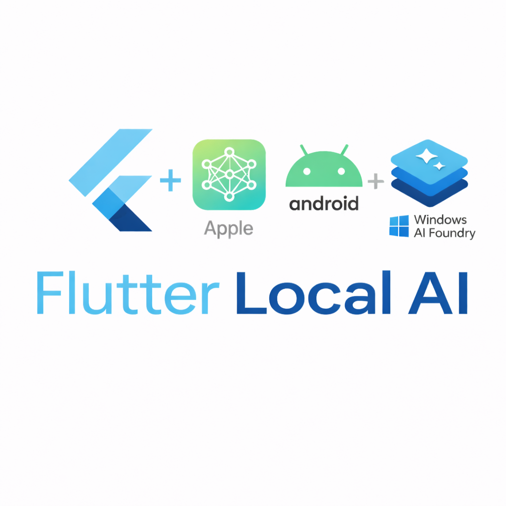
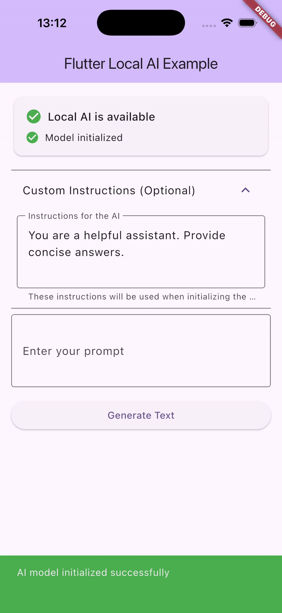

<div align="center">
  
</div>

<div align="center">

# Flutter Local AI

A Flutter package that provides a unified API for local AI inference on Android with [*ML Kit GenAI*](https://developers.google.com/ml-kit/genai), on Apple Platforms using [*Foundation Models*](https://developer.apple.com/documentation/FoundationModels), and on Windows using [*Windows AI APIs*](https://learn.microsoft.com/en-us/windows/ai/) (Windows AI Foundry).

Text generation (blocking or streamed), structured JSON outputs, tool calling, and **generative UI**: the on-device model can design small typed-block UI modules that render with the [`genui`](https://pub.dev/packages/genui) runtime — and, with tool calls, operate them afterwards.

`#ai` `#genui` `#structured-outputs` `#on-device-ai` `#gemini-nano` `#foundation-models`

</div>

<div align="center">
  
</div>


## ✨ Unique Advantage

**This package has the unique advantage of using native OS APIs without downloading or adding any additional layer to the application.**

- **iOS**: Uses Apple's built-in FoundationModels framework (iOS 26.0+) - no model downloads required
- **Android**: Uses Google's ML Kit GenAI (Gemini Nano) - leverages the native on-device model
- **Windows**: Uses Windows AI APIs (Windows AI Foundry) - Windows 11 22H2 (build 22621) or later
- **Zero Model Downloads**: No need to bundle large model files with your app
- **Native Performance**: Direct access to OS-optimized AI capabilities
- **Smaller App Size**: Models are part of the operating system, not your app bundle
- **Structured Outputs**: On Apple platforms, constrain generation to a JSON Schema and read the decoded object with `AiResponse.json`
- **Generative UI**: Turn a natural-language goal into a renderable [`genui`](https://pub.dev/packages/genui) module spec, on-device, identically on Apple FoundationModels and Android Gemini Nano (Pixel, Samsung, Xiaomi, OnePlus and [more](https://developers.google.com/ml-kit/genai))

## Platform Support

| Feature            | iOS / macOS (26+) | Android (API 26+) | Windows (11 22H2+) |
|--------------------|-------------------|-------------------|-------------------|
| Text generation    | ✅                | ✅                 | ⚠️ Testing         |
| Structured outputs | ✅                | ❌                 | ❌                 |
| Generative UI (genUI) | ✅             | ✅                 | 🚧 Planned         |
| Summarization*     | 🚧 Planned        | 🚧 Planned         | 🚧 Planned         |
| Image generation   | 🚧 Planned        | ❌                 | 🚧 Planned         |
| Tool calls         | ✅                | ❌                 | 🚧 Planned         |

*Summarization is achieved through text-generation prompts and shares the same API surface.

## Installation

Add this to your package's `pubspec.yaml` file:

```yaml
dependencies:
  flutter_local_ai:
    git:
      url: https://github.com/kekko7072/flutter_local_ai.git
```

Or if published to pub.dev:

```yaml
dependencies:
  flutter_local_ai: latest
```

### Android Setup

Requires Android API level 26 (Android 8.0 Oreo) or higher.

#### Step 1: Configure Minimum SDK Version

Set the minimum SDK version in your `android/app/build.gradle` or `android/app/build.gradle.kts`:

**For `build.gradle.kts` (Kotlin DSL):**
```kotlin
android {
    defaultConfig {
        minSdk = 26 // Required for ML Kit GenAI
    }
    
    compileOptions {
        sourceCompatibility = JavaVersion.VERSION_11
        targetCompatibility = JavaVersion.VERSION_11
    }
    
    kotlinOptions {
        jvmTarget = JavaVersion.VERSION_11.toString()
    }
}

dependencies {
    implementation("com.google.mlkit:genai-prompt:1.0.0-beta2")
    implementation("com.google.mlkit:genai-common:1.0.0-beta3")
    implementation("com.google.android.gms:play-services-tasks:18.2.0")
}
```

**For `build.gradle` (Groovy DSL):**
```groovy
android {
    defaultConfig {
        minSdkVersion 26 // Required for ML Kit GenAI
    }
    
    compileOptions {
        sourceCompatibility JavaVersion.VERSION_11
        targetCompatibility JavaVersion.VERSION_11
    }
    
    kotlinOptions {
        jvmTarget = '11'
    }
}

dependencies {
    implementation 'com.google.mlkit:genai-prompt:1.0.0-beta2'
    implementation 'com.google.mlkit:genai-common:1.0.0-beta3'
    implementation 'com.google.android.gms:play-services-tasks:18.2.0'
}
```

#### Step 2: Add AICore Library Declaration

Add the AICore library declaration to your `android/app/src/main/AndroidManifest.xml`:

```xml
<manifest xmlns:android="http://schemas.android.com/apk/res/android">
    <application
        android:label="your_app_name"
        android:name="${applicationName}"
        android:icon="@mipmap/ic_launcher">
        
        <!-- Required for ML Kit GenAI -->
        <uses-library android:name="com.google.android.aicore" android:required="false" />
        
        <!-- Your activities here -->
    </application>
</manifest>
```

**Important:** The `android:required="false"` attribute allows your app to run even if AICore is not installed. You should check availability programmatically (see below).

#### Step 3: Sync Your Project

Sync your project with Gradle files:
```bash
flutter pub get
flutter clean
flutter build apk
```

#### Step 4: Understanding Google AICore Requirement

Android's ML Kit GenAI requires **Google AICore** to be installed on the device. AICore is a separate system-level app that provides on-device AI capabilities (similar to Google Play Services).

**What is AICore?**
- A system-level Android app that provides on-device AI capabilities
- Includes Gemini Nano model for local inference
- Not installed by default on all devices
- Available through Google Play Store
- Similar to Google Play Services in how it works

**Error Code -101**: If you encounter error code -101, it means:
- AICore is not installed on the device, OR
- The installed AICore version is too low

**How to Handle AICore Not Installed:**

The plugin provides a helper method to open the Play Store:

```dart
final aiEngine = FlutterLocalAi();

try {
  final isAvailable = await aiEngine.isAvailable();
  if (!isAvailable) {
    print('Local AI is not available on this device');
    // Show user-friendly message
    return;
  }
  
  // Proceed with AI operations
  await aiEngine.initialize(instructions: 'You are a helpful assistant.');
  
} catch (e) {
  // Check if it's an AICore error (error code -101)
  if (e.toString().contains('-101') || e.toString().contains('AICore')) {
    // Show a dialog to the user explaining they need to install AICore
    showDialog(
      context: context,
      builder: (context) => AlertDialog(
        title: Text('AICore Required'),
        content: Text(
          'Google AICore is required for on-device AI features.\n\n'
          'Would you like to install it from the Play Store?'
        ),
        actions: [
          TextButton(
            onPressed: () => Navigator.pop(context),
            child: Text('Cancel'),
          ),
          ElevatedButton(
            onPressed: () async {
              Navigator.pop(context);
              await aiEngine.openAICorePlayStore();
            },
            child: Text('Install AICore'),
          ),
        ],
      ),
    );
  } else {
    print('Error: $e');
  }
}
```

**Manual Installation:**
Users can manually install AICore from:
- **Play Store**: https://play.google.com/store/apps/details?id=com.google.android.aicore
- **Package Name**: `com.google.android.aicore`

**Important Notes:**
- AICore is currently in limited availability and may not be available on all devices or in all regions
- Always check `isAvailable()` before using AI features
- Provide fallback options in your app when AICore is not available
- The `android:required="false"` in AndroidManifest allows your app to run even without AICore

#### Supported Android Devices

Any Android device on API 26+ can **install** an app using this plugin — on
unsupported hardware the feature simply reports unavailable (`isAvailable()`
returns `false`, `getModelStatus()` returns `unavailable`), so always gate your
UI on those checks instead of a device allowlist.

On-device **inference** via the Prompt API currently runs on (June 2026):

| Gemini Nano | Devices |
|---|---|
| nano-v2 | Pixel 9 / 9 Pro / 9 Pro XL / 9 Pro Fold; Samsung Galaxy Z Fold7, Z TriFold; Honor Magic V5, Magic 7 / 7 Pro; iQOO 13; Motorola Razr 60 Ultra / Razr Ultra 2025; OnePlus 13 / 13s; OPPO Find N5; POCO F7 Ultra, F8 Pro/Ultra, X7 Pro, X8 Pro; realme GT 7 Pro; vivo X200 FE, T4 Ultra; Xiaomi 14T Pro, 15 / 15T / 15T Pro / 15 Ultra, 17 / 17 Ultra, Pad Mini |
| nano-v3 | Pixel 10 / 10 Pro / 10 Pro XL / 10 Pro Fold; Samsung Galaxy S26 / S26+ / S26 Ultra; Honor Magic 8 Pro; iQOO 15; Lenovo Idea Tab Pro Gen 2, Legion Tab Gen 5; OnePlus 15 / 15R; OPPO Find X8 / X8 Pro / X9 / X9 Pro, Reno 14/15 Pro variants; realme GT 7T; vivo X200 / X200T / X200 Pro, X300 / X300 Pro |

Google expands this list with library and AICore updates — the canonical,
always-current list is on the
[ML Kit GenAI overview](https://developers.google.com/ml-kit/genai). Note that
AICore does not run on devices with an unlocked bootloader.

#### Debugging AICore Issues

If you're getting an AICore error on a device where AICore **IS** installed, the actual problem may be different (model not downloaded, permissions, etc.). The plugin now provides detailed error logging:

**View error details in Android Logcat:**
```bash
adb logcat -s FlutterLocalAi:E
```

The logs will show the actual exception type and error message, helping you identify the real issue. See `DEBUGGING_AICORE.md` for a complete debugging guide.

### iOS Setup

Requires iOS 26.0 or higher.

This plugin uses Swift Package Manager (SPM) for dependency management on iOS. The FoundationModels framework is automatically integrated by Flutter when you build your project.

#### Configuration Steps:

1. Open your iOS project in Xcode:
   - Open `ios/Runner.xcodeproj` in Xcode
   - Select the "Runner" project in the navigator
   - Under "Targets" → "Runner" → "General"
   - Set **Minimum Deployments** → **iOS** to **26.0**

2. In your `ios/Runner.xcodeproj/project.pbxproj`, verify that `IPHONEOS_DEPLOYMENT_TARGET` is set to `26.0`:

```
IPHONEOS_DEPLOYMENT_TARGET = 26.0;
```

3. If you encounter issues with SPM integration:

```bash
cd ios
flutter pub get
flutter clean
flutter build ios
```

### macOS Setup

Requires macOS 26.0 or higher.

The plugin uses Swift Package Manager (SPM) for dependency management on macOS. The FoundationModels framework is automatically integrated by Flutter when you build your project.

#### Configuration Steps:

1. Open your macOS project in Xcode:
   - Open `macos/Runner.xcodeproj` in Xcode
   - Select the "Runner" project in the navigator
   - Under "Targets" → "Runner" → "General"
   - Set **Minimum Deployments** → **macOS** to **26.0**

2. In your `macos/Runner.xcodeproj/project.pbxproj`, verify that `MACOSX_DEPLOYMENT_TARGET` is set to `26.0`:

```
MACOSX_DEPLOYMENT_TARGET = 26.0;
```

3. If you encounter issues with SPM integration:

```bash
cd macos
flutter pub get
flutter clean
flutter build macos
```

### Windows Setup

Requires Windows 11 22H2 (build 22621) or later.

The plugin uses Windows AI APIs (Windows AI Foundry) for local AI inference. Windows AI APIs are built into Windows 11 22H2 and later versions.

#### Configuration Steps:

1. **Verify Windows Version**: Ensure you're running Windows 11 22H2 (build 22621) or later:
   - Open Settings → System → About
   - Check the Windows version and build number

2. **Enable Windows AI Features**: Windows AI APIs should be available by default on supported Windows versions. If you encounter issues:
   - Ensure Windows is up to date
   - Check Windows Update for the latest features

3. **Build Your Flutter App**: The plugin will automatically be included when you build for Windows:
   ```bash
   flutter pub get
   flutter build windows
   ```

4. **Development Requirements**:
   - Visual Studio 2022 with C++ development tools
   - Windows 11 SDK (10.0.22621.0 or later)
   - CMake 3.14 or later

**Note**: Windows AI API integration is currently in progress. The plugin structure is in place and will be fully implemented as Windows AI Foundry APIs become available and documented.

## Usage

> **Note:** Text generation is available on iOS 26.0+, macOS 26.0+, Android API 26+ (requires Google AICore to be installed), and Windows 11 22H2+ (Windows AI APIs integration in progress).

### Basic Usage

```dart
import 'package:flutter_local_ai/flutter_local_ai.dart';

// Initialize the AI engine
final aiEngine = FlutterLocalAi();

// Check if Local AI is available on this device
final isAvailable = await aiEngine.isAvailable();
if (!isAvailable) {
  print('Local AI is not available on this device');
  print('iOS/macOS: Requires iOS 26.0+ or macOS 26.0+');
  print('Android: Requires API 26+ and Google AICore installed');
  print('Windows: Requires Windows 11 22H2 (build 22621) or later');
  return;
}

// Initialize the model with custom instructions
// This is required and creates a LanguageModelSession
await aiEngine.initialize(
  instructions: 'You are a helpful assistant. Provide concise answers.',
);

// Generate text with the simple method (returns just the text string)
final text = await aiEngine.generateTextSimple(
  prompt: 'Write a short story about a robot',
  maxTokens: 200,
);
print(text);
```

### Advanced Usage with Configuration

```dart
import 'package:flutter_local_ai/flutter_local_ai.dart';

final aiEngine = FlutterLocalAi();

// Check availability
if (!await aiEngine.isAvailable()) {
  print('Local AI is not available on this device');
  return;
}

// Initialize with custom instructions
await aiEngine.initialize(
  instructions: 'You are an expert in science and technology. Provide detailed, accurate explanations.',
);

// Generate text with detailed configuration
final response = await aiEngine.generateText(
  prompt: 'Explain quantum computing in simple terms',
  config: const GenerationConfig(
    maxTokens: 300,
    temperature: 0.7,  // Controls randomness (0.0 = deterministic, 1.0 = very random)
    topP: 0.9,         // Nucleus sampling parameter
    topK: 40,          // Top-K sampling parameter
  ),
);

// Access detailed response information
print('Generated text: ${response.text}');
print('Token count: ${response.tokenCount}');
print('Generation time: ${response.generationTimeMs}ms');
```

### Tool Calls (Apple platforms)

Tool calling lets the on-device model invoke Dart functions you define. Define tools in Dart, register them, and return JSON-serializable data from the handler:

- **iOS 26.0+ / macOS 26.0+**: native — tools are passed to Apple FoundationModels as `Tool` objects with a generation schema, so the model is constrained to produce valid calls.
- **Android**: not supported — the ML Kit GenAI Prompt API has no function calling (text/image in, text out only), and prompt-emulating a JSON call protocol proved too unreliable on Gemini Nano. `registerTools` throws an `UNSUPPORTED` error on Android; gate on `getPlatformInfo().supportsToolCalling` in cross-platform code. Google's Gemma 4 announcement points at agentic/tool-calling models reaching the Prompt API via AICore, so this is worth revisiting as the API surface evolves.

Register an empty list to disable tool use again.

```dart
import 'package:flutter_local_ai/flutter_local_ai.dart';

final aiEngine = FlutterLocalAi();

await aiEngine.registerTools([
  LocalAiTool(
    name: 'searchBreadDatabase',
    description: 'Searches a local database for bread recipes.',
    parameters: const [
      ToolParameter(
        name: 'searchTerm',
        type: ToolArgumentType.string,
        description: 'Type of bread to search for',
      ),
      ToolParameter(
        name: 'limit',
        type: ToolArgumentType.integer,
        description: 'Number of recipes to return',
      ),
    ],
    onCall: (arguments) async {
      final term = arguments['searchTerm'] as String? ?? '';
      final limit = (arguments['limit'] as num?)?.toInt() ?? 3;
      // Replace with your own lookup logic.
      return List.generate(
        limit,
        (index) => 'Recipe ${index + 1} for "$term"',
      );
    },
  ),
]);

await aiEngine.initialize(
  instructions: 'You are a helpful baking assistant. Use tools when needed.',
);

final response = await aiEngine.generateText(
  prompt: 'Find 2 sourdough recipes I might like.',
);
print(response.text);
```

### Structured Outputs (Apple platforms)

Pass a JSON Schema through `GenerationConfig` to *constrain* generation to valid
JSON instead of free-form text. On Apple FoundationModels this uses the same
schema-constrained generation that powers tool calling, so the model is forced to
emit a value matching your schema.

- **iOS 26.0+ / macOS 26.0+**: native. The schema is translated into a
  FoundationModels `GenerationSchema` and the JSON is returned in
  `AiResponse.text`; use `AiResponse.json` to get it decoded as a `Map`.
- **Android / Windows**: not supported — these backends are text-out only.
  Supplying a `schema` (or `responseFormat: ResponseFormat.json`) throws a
  `STRUCTURED_OUTPUT_UNSUPPORTED` error. Gate on
  `getPlatformInfo().supportsStructuredOutput` in cross-platform code.

Supported schema constructs: nested objects (with `required`), arrays (including
`minItems` / `maxItems`), string enums, and the scalar types (`string`,
`integer`, `number`, `boolean`). `description` is honored on properties. A schema
using any construct outside this subset is rejected with an `ArgumentError` in
Dart — before the platform channel — so you get a clear, path-qualified message
instead of an opaque native failure.

Supplying a `schema` implies JSON mode: you don't need to also set
`responseFormat: ResponseFormat.json` (though you can), and the value sent to the
backend is always self-consistent.

> **Streaming:** schema-constrained output is **not** available through
> `generateTextStream` on any backend yet (Apple's streaming path can't constrain
> to a schema, and Android is text-out only). Passing a `schema` to
> `generateTextStream` returns a stream that errors immediately — use
> `generateText` for structured output, or stream without a schema.

```dart
final platform = await aiEngine.getPlatformInfo();
if (!platform.supportsStructuredOutput) {
  // Fall back to text generation or a backend-specific parser.
  return;
}

final response = await aiEngine.generateText(
  prompt: 'Summarize this support ticket: "App crashes on launch after update."',
  config: const GenerationConfig(
    maxTokens: 300,
    responseFormat: ResponseFormat.json, // default is ResponseFormat.text
    schema: {
      'type': 'object',
      'properties': {
        'title': {'type': 'string', 'description': 'Short headline'},
        'priority': {
          'enum': ['low', 'med', 'high'],
        },
        'tags': {
          'type': 'array',
          'items': {'type': 'string'},
        },
      },
      'required': ['title'],
    },
  ),
);

final data = response.json; // Map<String, dynamic>? — decoded JSON object
print(data?['title']);

// For a schema whose root is an array or scalar, use decodedJson instead —
// .json only returns object roots.
final value = response.decodedJson; // Object? — any decoded JSON value
```

> Note: `ResponseFormat.json` requires a non-null `schema` — Apple can only
> constrain output when given a schema to constrain it to.

### Generative UI (genUI)

`flutter_local_ai` can turn a natural-language goal into a small, renderable UI
module entirely on-device. The local model decides which typed blocks best
express the goal and emits a JSON spec, which you can render with the
[`genui`](https://pub.dev/packages/genui) runtime or your own widgets.

This works **identically on Apple FoundationModels (iOS 26 / macOS 26) and
Android ML Kit GenAI / Gemini Nano (Pixel 9/10, Galaxy S26 / Z Fold7, and other
[supported devices](https://developers.google.com/ml-kit/genai))**. The genUI
schema is delivered through `initialize` instructions — prepended to the prompt
natively on Android — and the output-token budget and prompt are tuned per
backend (Gemini Nano caps output at 256 tokens, so the prompt asks the model for
compact JSON and fewer blocks to stay within budget).

```dart
import 'package:flutter_local_ai/flutter_local_ai.dart';

final aiEngine = FlutterLocalAi();
final generator = LocalAiUiGenerator(aiEngine);

// Generate a module from a goal. Returns null on any failure (model
// unavailable, generation blocked, invalid output) so you can fall back to a
// deterministic UI.
final GenUiModuleSpec? module = await generator.generateModule(
  'Save \$500 for a weekend trip',
  principles: 'Keep it simple and low-pressure', // optional design steering
  language: 'Italian',          // optional: force all user-facing copy
  onText: (raw) => print(raw),  // optional: live decode for progress UI
);

if (module == null) {
  // Inspect why and fall back.
  debugPrint('genUI unavailable: ${generator.lastError}');
} else {
  print(module.title);                 // e.g. "Weekend trip fund"
  print(module.blocks);                 // typed blocks: amount, progress, ...
  final json = module.toModuleJson();   // shape for your renderer
  // final components = module.toComponents(); // A2UI tree for genui's Surface
}

// The detected backend is available for labelling.
print(generator.backend); // LocalAiBackend.androidMlKitGenAi / appleFoundationModels
```

A `GenUiModuleSpec` is a stack of typed blocks (`amount`, `progress`,
`checklist`, `week`, `stat`, `list`, `lessons`, `reminder`, `calc`, `docs`,
`note`) that the model picks to fit the goal. The output is validated before it
is returned, and on small on-device models a truncated response is repaired
where possible so a partial module still renders.

#### genUI + tool calls: generated UI the model can operate (Apple platforms)

The two features compose: generate a module with `LocalAiUiGenerator`, then
register the module's mutations as tools — the same on-device model that
designed the UI can now act on it from natural language ("add 50 to the trip
fund"), with your `onCall` handlers applying the state changes:

```dart
// 1. The generated module's state lives in your app (here: a progress block).
var value = 300.0;

// 2. Expose its mutations as tools for one chat turn.
await aiEngine.registerTools([
  LocalAiTool(
    name: 'add_to_progress',
    description: 'Add an amount to the savings progress.',
    parameters: const [
      ToolParameter(
        name: 'amount',
        type: ToolArgumentType.number,
        description: 'Amount to add',
      ),
    ],
    onCall: (args) {
      value += (args['amount'] as num).toDouble();
      return {'ok': true, 'value': value}; // grounds the model's confirmation
    },
  ),
]);

// 3. One generation = the whole turn: the model calls the tool, reads the
//    result, and answers in plain text. Scope the registration to the turn —
//    clear it afterwards so later generations (e.g. genUI) stay tool-free.
try {
  final res = await aiEngine.generateText(
    prompt: 'CURRENT STATE: {"value": $value, "target": 600}\n\n'
        'USER MESSAGE: "add 50 to my trip fund"',
    instructions: 'You operate a savings tracker. Use the tools to apply '
        'changes, then confirm in one short sentence.',
  );
  print(res.text); // "Done — your trip fund is at $350 of $600."
} finally {
  await aiEngine.registerTools(const []);
}
```

This is the pattern behind a genUI chat: hand the model the module state (the
`toModuleJson()` shape) plus per-block tools, and every dashboard edit the UI
can do becomes something the model can do too.

#### Reusing the genUI engine with other backends

The schema and parser are exposed as statics so any on-device backend (for
example a downloaded Gemma model via `flutter_gemma`) can drive the exact same
genUI generation:

```dart
// The system instructions (module/block schema) to pass to your own model.
final instructions = LocalAiUiGenerator.genUiInstructions;

// Parse and validate raw model text into a GenUiModuleSpec (handles code
// fences, leading/trailing prose, and truncated/closing-bracket repair).
final GenUiModuleSpec? spec = LocalAiUiGenerator.parseModelOutput(rawModelText);
```

### Streaming Text Generation

`generateTextStream` yields delta chunks as the model decodes — ideal for
typing the answer into the UI live, or for the genUI generator's `onText`
preview. On Apple it maps to FoundationModels' streamed snapshots, on Android
to ML Kit's `StreamingCallback`.

```dart
final buffer = StringBuffer();
await for (final chunk in aiEngine.generateTextStream(
  prompt: 'Write a two-line poem about autumn',
  config: const GenerationConfig(maxTokens: 120, temperature: 0.7),
  instructions: 'You are a poet.', // optional one-shot session, see below
)) {
  buffer.write(chunk);
  print(buffer); // cumulative text so far
}
```

Notes:
- The optional `instructions:` parameter (also on `generateText`) runs the call
  in a **one-shot throwaway session** with exactly those instructions — nothing
  accumulates in the session created by `initialize`. Use it for stateless
  callers that carry their own context in the prompt (on Apple, a shared
  session's transcript counts toward the 4096-token context window).

### Complete Example

Here's a complete example showing error handling and best practices:

```dart
import 'package:flutter/material.dart';
import 'package:flutter_local_ai/flutter_local_ai.dart';

class LocalAiExample extends StatefulWidget {
  @override
  _LocalAiExampleState createState() => _LocalAiExampleState();
}

class _LocalAiExampleState extends State<LocalAiExample> {
  final aiEngine = FlutterLocalAi();
  bool isInitialized = false;
  String? result;
  bool isLoading = false;

  @override
  void initState() {
    super.initState();
    _initializeAi();
  }

  Future<void> _initializeAi() async {
    try {
      final isAvailable = await aiEngine.isAvailable();
      if (!isAvailable) {
        setState(() {
          result = 'Local AI is not available on this device. Requires iOS 26.0+ or macOS 26.0+';
        });
        return;
      }

      await aiEngine.initialize(
        instructions: 'You are a helpful assistant. Provide concise and accurate answers.',
      );

      setState(() {
        isInitialized = true;
        result = 'AI initialized successfully!';
      });
    } catch (e) {
      setState(() {
        result = 'Error initializing AI: $e';
      });
    }
  }

  Future<void> _generateText(String prompt) async {
    if (!isInitialized) {
      setState(() {
        result = 'AI is not initialized yet';
      });
      return;
    }

    setState(() {
      isLoading = true;
    });

    try {
      final response = await aiEngine.generateText(
        prompt: prompt,
        config: const GenerationConfig(
          maxTokens: 200,
          temperature: 0.7,
        ),
      );

      setState(() {
        result = response.text;
        isLoading = false;
      });
    } catch (e) {
      setState(() {
        result = 'Error generating text: $e';
        isLoading = false;
      });
    }
  }

  @override
  Widget build(BuildContext context) {
    return Scaffold(
      appBar: AppBar(title: const Text('Flutter Local AI')),
      body: Padding(
        padding: const EdgeInsets.all(16.0),
        child: Column(
          children: [
            ElevatedButton(
              onPressed: isLoading ? null : () => _generateText('Tell me a joke'),
              child: const Text('Generate Joke'),
            ),
            const SizedBox(height: 20),
            if (isLoading)
              const CircularProgressIndicator()
            else if (result != null)
              Text(result!),
          ],
        ),
      ),
    );
  }
}
```

### Platform-Specific Notes

#### iOS & macOS

- **Initialization is required**: You must call `initialize()` before generating text. This creates a `LanguageModelSession` with your custom instructions.
- **Session reuse**: The session is cached and reused for subsequent generation calls until you call `initialize()` again with new instructions.
- **Automatic fallback**: If you don't call `initialize()` explicitly, it will be called automatically with default instructions when you first generate text. However, it's recommended to call it explicitly to set your custom instructions.
- **Model availability**: The FoundationModels framework is automatically available on devices running iOS 26.0+ or macOS 26.0+.
- **Structured outputs and tool calls**: Both are native FoundationModels features. Check `getPlatformInfo().supportsStructuredOutput` before passing a schema in cross-platform code.

#### Android

- **AICore Required**: Google AICore must be installed on the device for ML Kit GenAI to work
- **Availability Check**: Always call `isAvailable()` before using AI features
- **Error Handling**: Handle error code -101 (AICore not installed) gracefully
- **Initialization**: `initialize()` is optional on Android but recommended for consistency
- **Model Access**: Uses Gemini Nano via ML Kit GenAI - no model downloads required
- **Structured outputs and tool calls**: Not supported by the ML Kit GenAI Prompt API. Passing `schema` or `ResponseFormat.json` throws `STRUCTURED_OUTPUT_UNSUPPORTED`; `registerTools` throws `UNSUPPORTED`.

#### Windows

- **Windows Version Required**: Windows 11 22H2 (build 22621) or later is required
- **Windows AI APIs**: Uses Windows AI Foundry APIs for local AI inference
- **Availability Check**: Always call `isAvailable()` before using AI features
- **Initialization**: `initialize()` is required before generating text
- **Status**: Windows AI API integration is currently in progress. The plugin structure is in place and ready for full implementation as Windows AI Foundry APIs become available
- **Structured outputs**: Not supported by the current text-out Windows backend. Passing `schema` or `ResponseFormat.json` throws `STRUCTURED_OUTPUT_UNSUPPORTED`.

**Example with AICore Error Handling:**
```dart
final aiEngine = FlutterLocalAi();

try {
  final isAvailable = await aiEngine.isAvailable();
  if (!isAvailable) {
    // Show user-friendly message
    print('Local AI is not available. AICore may not be installed.');
    return;
  }
  
  await aiEngine.initialize(
    instructions: 'You are a helpful assistant.',
  );
  
  final response = await aiEngine.generateText(
    prompt: 'Hello!',
    config: const GenerationConfig(maxTokens: 100),
  );
  
  print(response.text);
} catch (e) {
  // Handle AICore error (-101)
  if (e.toString().contains('-101') || e.toString().contains('AICore')) {
    // Open Play Store to install AICore
    await aiEngine.openAICorePlayStore();
  } else {
    print('Error: $e');
  }
}
```

## API Reference

### `FlutterLocalAi`

Main class for interacting with local AI.

#### Methods

- `Future<bool> isAvailable()` - Check if local AI is available on the device
- `Future<String> availabilityReason()` - A human-readable reason when it is not (eligibility, model downloadable/downloading, OS version…)
- `Future<bool> initialize({String? instructions})` - Initialize the model and create a session with instruction text (required for iOS, recommended for Android)
- `Future<AiResponse> generateText({required String prompt, GenerationConfig? config, String? instructions})` - Generate text; per-call `instructions` run a one-shot throwaway session
- `Stream<String> generateTextStream({required String prompt, GenerationConfig? config, String? instructions})` - Generate text as a stream of delta chunks
- `Future<String> generateTextSimple({required String prompt, int maxTokens = 100})` - Convenience method to generate text and return just the string
- `Future<void> registerTools(List<LocalAiTool> tools)` - Register Dart tools the model may call during generation (Apple platforms only; pass `const []` to clear)
- `Future<LocalAiPlatformInfo> getPlatformInfo()` - The detected backend and its capabilities (`supportsToolCalling`, `supportsStructuredOutput`, `supportsModelDownload`, …)
- `Future<ModelFeatureStatus> getModelStatus()` - `available` / `downloadable` / `downloading` / `unavailable` (Android Gemini Nano)
- `Stream<ModelDownloadStatus> downloadModel()` - Request the one-time on-device model download and observe its progress; failures always surface on the stream
- `Future<bool> openAICorePlayStore()` - Open Google AICore in the Play Store (Android only, useful when error -101 occurs)

### `LocalAiTool` / `ToolParameter`

A Dart-defined tool the on-device model can invoke (see Tool Calls above).

- `LocalAiTool({required name, required description, required parameters, required onCall})` - `onCall` receives the model's arguments as a `Map<String, dynamic>` and returns JSON-serializable data fed back to the model
- `ToolParameter({required name, type, description, optional})` - typed parameter (`ToolArgumentType.string/integer/number/boolean`)

### `GenerationConfig`

Configuration for text generation.

- `maxTokens` (int, default: 100) - Maximum number of tokens to generate
- `temperature` (double?, optional) - Temperature for generation (0.0 to 1.0)
- `topP` (double?, optional) - Top-p (nucleus) sampling. On Apple maps to `.random(probabilityThreshold:)`
- `topK` (int?, optional) - Top-k sampling. On Apple maps to `.random(top:)` and takes precedence over `topP`
- `responseFormat` (`ResponseFormat`, default: `text`) - `text` for free-form output, or `json` for schema-constrained JSON (Apple only). `json` requires a non-null `schema`
- `schema` (`Map<String, dynamic>?`, optional) - JSON Schema the output is constrained to (Apple only; see Structured Outputs above). Supplying a schema implies JSON mode and is validated in Dart before the platform channel

> Sampling precedence on Apple: topK > topP > temperature > greedy. `.greedy` is
> never combined with a temperature (that pairing throws on-device).

### `AiResponse`

Response from AI generation.

- `text` (String) - The generated text (or the JSON string when structured output was requested)
- `json` (`Map<String, dynamic>?`) - `text` decoded as a JSON object, or `null` if it isn't one
- `decodedJson` (`Object?`) - `text` decoded as any JSON value (object, array, scalar), or `null` if it isn't valid JSON — use for schemas whose root is an array or scalar
- `tokenCount` (int?) - Token count used
- `generationTimeMs` (int?) - Generation time in milliseconds

### `LocalAiPlatformInfo`

Detected backend metadata and capability flags returned by `getPlatformInfo()`.

- `backend` (`LocalAiBackend`) - The active backend (`appleFoundationModels`, `androidMlKitGenAi`, `windowsAiFoundry`, `windowsAiFoundryUnconfigured`, or `unsupported`)
- `supportsToolCalling` (bool) - Whether `registerTools` can expose Dart tools to the native model
- `supportsStructuredOutput` (bool) - Whether `GenerationConfig.schema` / `ResponseFormat.json` can constrain the model to JSON output
- `supportsModelDownload` (bool) - Whether `downloadModel()` can request an on-device model download
- `supportsPlayStoreRedirect` (bool) - Whether `openAICorePlayStore()` can redirect to Google AICore
- `isConfigured` (bool) - Whether the native backend is compiled/configured for the current platform

### `LocalAiUiGenerator`

Turns a natural-language goal into a `GenUiModuleSpec` using the on-device model
(Apple FoundationModels or Android ML Kit GenAI / Gemini Nano).

- `LocalAiUiGenerator([FlutterLocalAi? ai])` - Create a generator (reuses or creates an engine)
- `Future<GenUiModuleSpec?> generateModule(String goal, {String? principles, String? language, void Function(String)? onText})` - Generate a module; `language` forces all user-facing copy into that language, `onText` streams the raw decode for live progress UI; returns `null` on any failure
- `LocalAiBackend get backend` - The detected on-device backend
- `bool? get available` - Whether the model reported itself available (cached)
- `String? get lastError` - The last platform error encountered, for diagnostics
- `static String get genUiInstructions` - The module/block schema instructions, for reuse with other backends
- `static GenUiModuleSpec? parseModelOutput(String text)` - Parse + validate raw model text (handles fences, prose, truncation)

### `GenUiModuleSpec`

A validated genUI module produced by the local model.

- `title`, `icon`, `tone`, `blurb` (String) - Module header fields
- `blocks` (List<Map<String, dynamic>>) - Ordered typed blocks
- `Map<String, dynamic> toModuleJson()` - Shape for a typed-block renderer
- `List<Component> toComponents()` - An A2UI component tree for the `genui` `Surface`

## Implementation Notes

### Android

The Android implementation uses ML Kit GenAI (Gemini Nano) via Google AICore.

**Key Android Requirements:**
- Android 8.0 (API level 26) or higher
- Google AICore installed on the device
- Java 11 or higher (configured in build.gradle)
- Kotlin JVM target 11

**Android Implementation Details:**
- Uses `com.google.mlkit.genai.prompt.Generation.getClient()` for model access
- Handles AICore availability checking and error detection
- Provides automatic error code -101 detection
- Includes Play Store integration for AICore installation
- Uses coroutines with SupervisorJob for async operations
- Properly manages GenerativeModel lifecycle
- Reports `supportsStructuredOutput: false` and rejects schema-constrained generation requests because the Prompt API is text-in/text-out

**Android Error Handling:**
- Error code -101: AICore not installed or version too low
- Detailed error logging via Android Logcat (`adb logcat -s FlutterLocalAi:E`)
- Graceful degradation when AICore is unavailable

**Android Configuration:**
The plugin automatically registers via Flutter's `GeneratedPluginRegistrant`. No manual registration needed in MainActivity.

### iOS
The iOS implementation uses Apple's FoundationModels framework (iOS 26.0+). The implementation:

- Uses `SystemLanguageModel.default` for model access
- Creates a `LanguageModelSession` with custom instructions
- Handles model availability checking
- Provides on-device text generation with configurable parameters
- Translates supported JSON Schema maps into FoundationModels `GenerationSchema` values for structured outputs

**Key iOS Requirements:**
- iOS 26.0 or later
- Xcode 16.0 or later
- FoundationModels framework (automatically available on supported devices)

**iOS Initialization:**
On iOS, you must call `initialize()` before generating text. This creates a `LanguageModelSession` with your custom instructions. The session is cached and reused for subsequent generation calls.

```dart
// Required on iOS
await aiEngine.initialize(
  instructions: 'Your custom instructions here',
);
```

### Windows
The Windows implementation uses Windows AI APIs (Microsoft Foundry on Windows) for local AI inference on Copilot+ PCs.
The current Windows backend reports `supportsStructuredOutput: false` and rejects schema-constrained generation requests.

**What are Copilot+ PCs?**
Copilot+ PCs are a new class of Windows 11 hardware powered by a high-performance Neural Processing Unit (NPU) that can perform more than 40 trillion operations per second (40+ TOPS). These devices provide all-day battery life and access to advanced AI features and models. The NPU is a specialized chip for AI-intensive processes like real-time translations and image generation, working in alignment with the CPU and GPU to deliver fast and efficient performance.

**Key Windows Requirements:**
- **Copilot+ PC** with NPU capable of 40+ TOPS (required for Windows AI APIs)
- Windows 11 24H2 (build 26100) or later
- Visual Studio 2022 with C++ development tools
- Windows 11 SDK (10.0.26100.0 or later)
- CMake 3.14 or later

**Supported Copilot+ PC Devices:**
Windows AI APIs require a Copilot+ PC with an NPU capable of 40+ TOPS. Supported devices include:

- Microsoft Surface Laptop Copilot+ PC
- Microsoft Surface Pro Copilot+ PC
- HP OmniBook X 14
- Dell Latitude 7455, XPS 13, and Inspiron 14
- Acer Swift 14 AI
- Lenovo Yoga Slim 7x and ThinkPad T14s
- Samsung Galaxy Book4 Edge
- ASUS Vivobook S 15 and ProArt PZ13
- Copilot+ PCs with AMD Ryzen AI 300 series
- Copilot+ PCs with Intel Core Ultra 200V series
- Surface Copilot+ PCs for Business (Series 2) with Intel Core Ultra processors

For a complete list of supported devices, see: [Windows AI NPU Devices Documentation](https://learn.microsoft.com/en-us/windows/ai/npu-devices/)

**What is the Arm-based Snapdragon Elite X chip?**
The Snapdragon X Elite Arm-based chip built by Qualcomm emphasizes AI integration through its industry-leading Neural Processing Unit (NPU). This NPU processes large amounts of data in parallel, performing trillions of operations per second, using energy more efficiently than a CPU or GPU, resulting in longer device battery life. The NPU works in alignment with the CPU and GPU, with Windows 11 assigning processing tasks to the most appropriate component for optimal performance.

**Windows Implementation Details:**
- Uses C++/WinRT for Windows Runtime API access
- Implements Flutter method channel for cross-platform communication
- Checks Windows version and Copilot+ PC compatibility to determine AI API availability
- Leverages Windows AI APIs (`Microsoft.Windows.AI.LanguageModel`) for local inference
- Uses **Windows ML** (recommended) for NPU acceleration - Windows ML automatically:
  - Detects available hardware accelerators (NPU, GPU, CPU)
  - Selects the most performant Execution Provider (EP) automatically
  - Downloads required EPs via Windows Update (no manual bundling needed)
  - Falls back gracefully if preferred EP fails or is unavailable
- ONNX Runtime is used under the hood for model inference
- Optimized for NPU execution with automatic hardware acceleration

**Windows Status:**
Windows AI API integration is implemented and ready to use on Copilot+ PCs. The plugin provides:
- Platform availability checking for Copilot+ PCs (Windows 11 24H2+ with 40+ TOPS NPU)
- Method channel implementation matching other platforms
- Full Windows AI API integration using `Microsoft.Windows.AI.LanguageModel`
- Automatic NPU acceleration via Windows ML
- Error handling and initialization flow
- Graceful fallback messaging when Copilot+ PC requirements are not met

**Windows Configuration:**
The plugin automatically registers via Flutter's plugin registration system. The Windows plugin is built using CMake and integrated into the Flutter Windows build process.

**Enabling Windows AI Support:**
The Windows AI headers need to be available for the plugin to use Windows AI APIs. By default, the plugin compiles without Windows AI headers and will return appropriate error messages.

To enable Windows AI support:
1. Install the Windows AI SDK or obtain the `Microsoft.Windows.AI.winmd` metadata file
2. Generate C++/WinRT headers using `cppwinrt.exe`:
   ```bash
   cppwinrt.exe -input "path/to/Microsoft.Windows.AI.winmd" -output "generated"
   ```
3. Add the generated headers path to your include directories in `windows/CMakeLists.txt`
4. In `windows/flutter_local_ai_plugin.cpp`, uncomment the line:
   ```cpp
   #include <winrt/Microsoft.Windows.AI.h>
   ```
5. Set `WINDOWS_AI_AVAILABLE` to `1` or define it in CMakeLists.txt

Alternatively, if using Visual Studio, you can add the Windows AI NuGet package to your project, which will provide the headers automatically.

**How Windows AI Accesses the NPU:**
The Neural Processing Unit (NPU) is a hardware resource that requires specific software programming to take advantage of its benefits. NPUs are designed to execute the deep learning math operations that make up AI models.

**Programmatic Access via Windows ML:**
The recommended way to programmatically access the NPU for AI acceleration is through **Windows ML** (not DirectML). Windows ML provides:

- **Built-in EP discovery**: Automatically detects available hardware and downloads appropriate Execution Providers (EPs) as needed
- **Integrated EP delivery**: Required EPs (e.g., Qualcomm's QNNExecutionProvider, Intel's OpenVINO EP) are bundled with Windows or delivered via Windows Update
- **ORT under the hood**: Uses ONNX Runtime as the inference engine while abstracting EP management complexity
- **Hardware vendor collaboration**: Microsoft works with Qualcomm, Intel, and AMD to ensure EP compatibility

When deploying an AI model using Windows ML on a Copilot+ PC:
1. Windows ML queries the system for available hardware accelerators
2. It selects the most performant EP (QNN for Qualcomm NPUs, OpenVINO for Intel NPUs)
3. The EP is loaded automatically, and inference begins
4. If the preferred EP fails, Windows ML gracefully falls back to GPU or CPU

**Supported Model Formats:**
- AI models need to be converted (quantized) to run on NPUs, typically to INT8 format for increased performance and power efficiency
- **Qualcomm AI Hub**: Provides pre-validated models optimized for Snapdragon X Elite NPU
- **ONNX Model Zoo**: Open source repository with pre-trained models in ONNX format, recommended for all Copilot+ PCs
- **Bring Your Own Model (BYOM)**: Use hardware-aware optimization tools like Olive for model compression and compilation

**Performance Measurement:**
Windows provides several tools to measure AI model performance:
- **Task Manager**: View real-time NPU utilization, memory usage, and driver information
- **Windows Performance Recorder (WPR)**: Records NPU activity with Neural Processing profile
- **Windows Performance Analyzer (WPA)**: Analyzes NPU usage, callstacks, and ONNX Runtime events
- **GPUView**: Visualizes both GPU and NPU operations
- **ONNX Runtime Profiling**: Track inference times, EP parameters, and operator-level performance

For detailed performance measurement guidance, see: [How to measure performance of AI models running locally on the device NPU](https://learn.microsoft.com/en-us/windows/ai/develop-ai-apps-for-copilot-plus-pcs#how-to-measure-performance-of-ai-models-running-locally-on-the-device-npu)

**Additional Resources:**
- [Develop AI applications for Copilot+ PCs](https://learn.microsoft.com/en-us/windows/ai/develop-ai-apps-for-copilot-plus-pcs)
- [What is Microsoft Foundry on Windows?](https://learn.microsoft.com/en-us/windows/ai/what-is-microsoft-foundry-on-windows)
- [What are Windows AI APIs?](https://learn.microsoft.com/en-us/windows/ai/what-are-windows-ai-apis)
- [Windows ML Documentation](https://learn.microsoft.com/en-us/windows/ai/windows-ml/)
- [Windows on Arm Overview](https://learn.microsoft.com/en-us/windows/arm/overview)

## Contributing

Contributions are welcome! Please feel free to submit a Pull Request.
